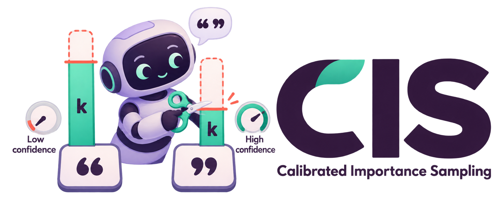
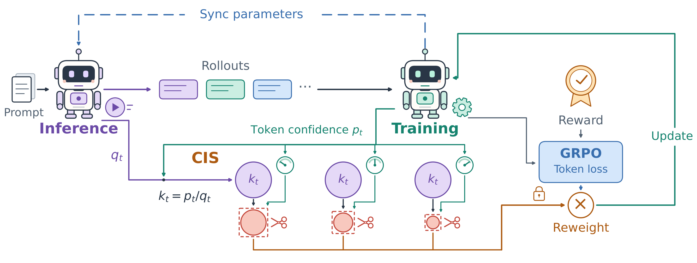
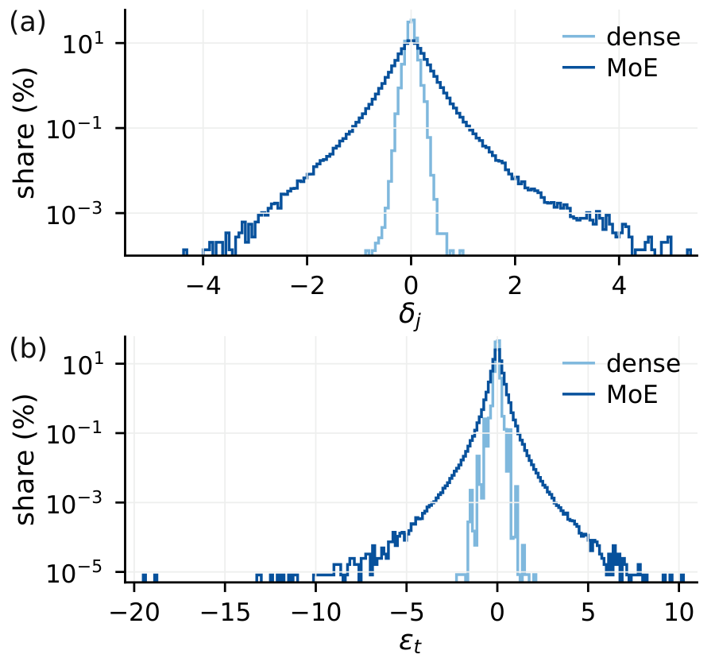
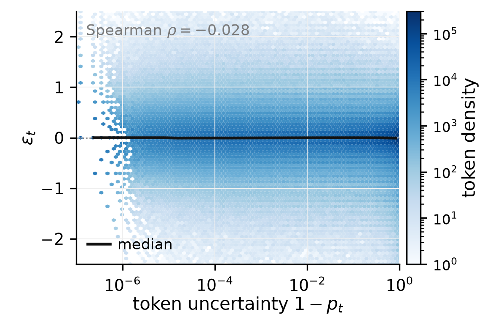
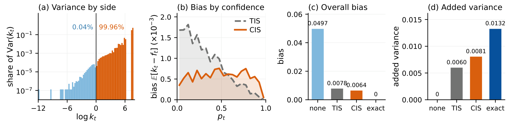
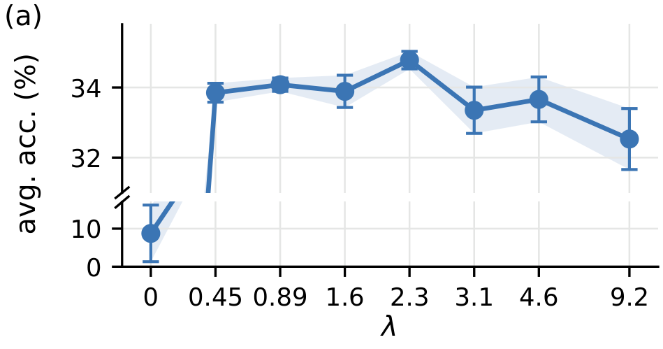
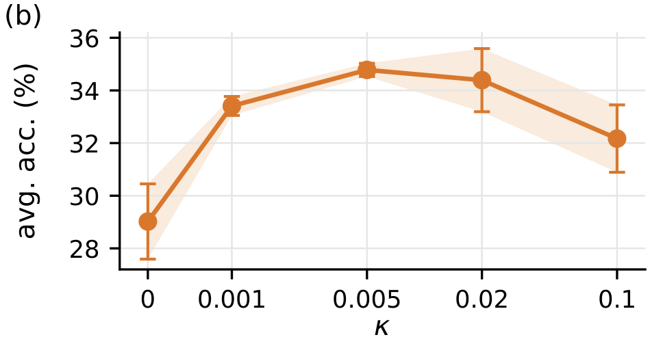

<div align="center">
<br>

<h3>Rethinking Training–Inference Mismatch in LLM Reinforcement Learning:<br>Where It Arises and How to Correct It</h3>

[](https://arxiv.org/abs/2609.32444)
[](paper/CIS.pdf)
[](https://www.python.org/)
[](https://pytorch.org/)
[](https://github.com/areal-project/AReaL)
[](#-reproducing-the-paper)
[](LICENSE)

</div>

<p align="center"></p>
<p align="center"><em>Overview of CIS (Figure 1): the inference and training engines assign different probabilities to the same tokens. CIS truncates the importance ratios with confidence-dependent caps, which are tighter for more confident tokens.</em></p>

## 🌌 Introduction

In reinforcement learning for large language models, rollouts are sampled by an inference engine (vLLM, SGLang) while gradients are computed by a training engine (FSDP). The two engines assign different probabilities to the same sampled token, so nominally on-policy training becomes slightly off-policy. The per-token importance ratio $k_t = p_t / q_t$ between the training-side probability $p_t$ and the inference-side probability $q_t$ corrects for this mismatch, but using it directly is high-variance, and fixed caps or masks (TIS, IcePop, ...) treat a confident token and an uncertain token the same way.

**Where the mismatch arises.** The two engines compute slightly different logits, and this per-logit perturbation before the softmax enters the ratio as an additive displacement in log-odds,

$$\varepsilon_t = \mathrm{logit}\, p_t - \mathrm{logit}\, q_t, \qquad k_t = p_t + (1 - p_t)\, e^{\varepsilon_t}.$$

The distribution of $\varepsilon_t$ is approximately invariant to token confidence, and it has a heavy tail on mixture-of-experts models. The spread of $k_t$ around one, in contrast, shrinks by orders of magnitude as $p_t \to 1$.

**How to correct it.** Calibrated importance sampling (CIS) truncates the displacement at a single constant threshold, $e^{\varepsilon_t} \le 1 + \lambda$. Through the identity above, this becomes a ratio cap that tightens as the token becomes more confident:

$$f_t = \min\lbrace k_t,\; 1 + \lambda\,\varphi_t\rbrace, \qquad \varphi_t = \max(1 - p_t,\ \kappa).$$

The floor $\kappa$ keeps the cap of confident tokens above the storage resolution of the log-probabilities. CIS replaces the unbounded second moment that governs the error of exact importance sampling with a term bounded by a constant, at the cost of a bias controlled by the truncated excess. It adds one elementwise operation and no forward or backward pass.

<p align="center">

&nbsp;&nbsp;

</p>
<p align="center"><em>Left (Figure 2): per-logit perturbation (a) and log-odds displacement (b) on a mixture-of-experts model and a dense model. Right (Figure 4): the displacement against token uncertainty on Qwen1.5-MoE-A2.7B; its scale changes only mildly over six orders of magnitude of 1 − p<sub>t</sub>.</em></p>

## 📰 News

- **[2026-09]** The paper is on arXiv: [arXiv:2609.32444](https://arxiv.org/abs/2609.32444). A PDF copy is also in [`paper/CIS.pdf`](paper/CIS.pdf).
- **[2026-09]** Code release: the CIS operator, the AReaL integration, the training recipe for three mixture-of-experts models, the evaluation suite, and the mismatch measurement pipeline.

## 📊 Results

RL on GSM8K with the same recipe for every method; held-out accuracy (%) averaged over GSM8K, MATH-500, SVAMP, Minerva Math, and OlympiadBench, with mean ± standard deviation over three seeds. The full comparison with nine baselines is in Table 1 of the [paper](https://arxiv.org/abs/2609.32444).

| Model | No correction | TIS | Best baseline | **CIS** |
|---|---|---|---|---|
| Qwen1.5-MoE-A2.7B | 30.99 ± 0.22 | 31.40 ± 2.47 | 34.18 ± 0.55 (IcePop) | **34.78 ± 0.25** |
| DeepSeek-V2-Lite | 35.83 ± 1.08 | 36.02 ± 0.51 | 36.73 ± 0.73 (IcePop) | **37.16 ± 0.73** |
| Qwen3-30B-A3B | 68.26 ± 0.27 | 69.14 ± 0.30 | 69.23 ± 0.16 (GSPO) | **69.88 ± 0.55** |

<p align="center"></p>
<p align="center"><em>Diagnostics (Figure 5): (a) share of Var(k<sub>t</sub>) on each side of log k<sub>t</sub> = 0; (b) truncation bias across confidence bins, where TIS concentrates its bias on low-confidence tokens; (c) overall bias relative to exact correction; (d) added variance relative to no correction.</em></p>

<details>
<summary><b>Sensitivity to λ and κ (Figure 6)</b></summary>
<p align="center">

&nbsp;&nbsp;

</p>
<p align="center"><em>Five-benchmark average on Qwen1.5-MoE-A2.7B over three seeds. Every positive threshold λ outperforms the uncorrected run, while λ = 0 (a hard cap at one) collapses. The floor κ works best near the storage resolution of the log-probabilities.</em></p>
</details>

## ⚙️ Installation

The experiments use two Python environments: a training environment with the patched AReaL, and a measurement and evaluation environment with a recent vLLM.

| Environment | Used by | Key versions |
|---|---|---|
| **train** (Python 3.11) | `scripts/train.sh` | torch 2.9.1, transformers 5.3.0, SGLang 0.5.10.post1, vLLM 0.16.0 |
| **measure/eval** (Python 3.12) | `measurement/`, `eval/` | torch 2.11.0, transformers 5.14.1, vLLM 0.26.0, math-verify 0.9.0 |

```bash
git clone https://github.com/kzhao5/CIS-RL.git
cd CIS-RL

# 1. training env: check out AReaL at the pinned commit and apply the CIS patch
bash areal_patch/apply_patch.sh              # -> third_party/AReaL
#    install third_party/AReaL following the upstream instructions,
#    then align versions with requirements/train.txt

# 2. measurement and evaluation env
pip install -r requirements/measure_eval.txt

# 3. point the scripts at the two interpreters (defaults: `python`)
export AREAL_PYTHON=/path/to/train-env/bin/python
export CIS_PYTHON=/path/to/measure-env/bin/python

# 4. tests (the AReaL equivalence test runs when the patched AReaL is importable)
$AREAL_PYTHON -m pytest tests -q
```

All outputs go to `$CIS_WORKDIR` (default `./outputs`), and RL runs go to `$RUN_ROOT` (default `$CIS_WORKDIR/rl`).

## 🚀 Quick Start

### Use CIS in your own trainer

CIS needs only the two log-probabilities of each sampled token, which every decoupled PPO or GRPO implementation already has. Wherever a TIS weight `k.clamp(max=C)` is computed, replace it with the CIS weight:

```python
from cis import cis_weight

# logp_train: log-probs of the sampled tokens recomputed by the training engine
# logp_infer: log-probs recorded by the inference engine at sampling time
w = cis_weight(logp_train, logp_infer, lam=2.3, kappa=5e-3)   # no gradient

loss = (w * token_pg_loss * mask).sum() / mask.sum()
```

`cis.cis_policy_loss` gives a complete token-level decoupled PPO loss with the CIS weight. The inference-side log-probability must be the raw value recorded at the sampling step, with no temperature rescaling or renormalization applied afterwards.

### Use CIS in AReaL

The patch adds `cis` as an action of AReaL's `rejection_sampling` config:

```yaml
actor:
  use_decoupled_loss: true
  rejection_sampling:
    level: token
    action: cis
    metric: ratio
    cis_lambda: 2.3
    cis_kappa: 5.0e-3
```

### Hyperparameters

| Argument | Default | Paper symbol | Meaning |
|---|---|---|---|
| `cis_lambda` / `lam` | 2.3 | $\lambda$ | Threshold; the cap on $k_t$ is $1 + \lambda\max(1-p_t,\kappa)$. |
| `cis_kappa` / `kappa` | 5e-3 | $\kappa$ | Floor on $1-p_t$, near the storage resolution of the log-probabilities. |

Both were chosen on Qwen1.5-MoE-A2.7B and kept fixed for the other two models.

## 🔬 Reproducing the Paper

### RL training

```bash
MODEL=moe  SEED=1 bash scripts/train.sh
MODEL=dsv2 SEED=1 bash scripts/train.sh
MODEL=q30b SEED=1 bash scripts/train.sh
LAMBDA=1.6 MODEL=moe SEED=1 TAG=_lam1.6 bash scripts/train.sh   # hyperparameter sweep
```

One run uses one node with eight GPUs (A100-80GB in the paper): four serve rollouts and four train with FSDP. The script trains for three epochs over the 7,473 GSM8K training problems (87 optimizer steps) and then evaluates the final checkpoint (`RUN_EVAL=0` skips this). The recipe is learning rate 3e-6, weight decay 0.01, PPO clip range (0.2, 0.28), four samples per prompt at temperature one, at most 1,024 generated tokens, at most two versions of rollout staleness, and no KL penalty.

| `MODEL` | Checkpoint | Rollout engine |
|---|---|---|
| `moe` | `Qwen/Qwen1.5-MoE-A2.7B-Chat` | SGLang |
| `dsv2` | `deepseek-ai/DeepSeek-V2-Lite-Chat` | vLLM |
| `q30b` | `Qwen/Qwen3-30B-A3B` (thinking disabled) | vLLM, tensor parallel 2 |

<details>
<summary><b>What else the AReaL patch contains</b></summary>

Besides the `cis` action and the `gsm8k_cis.yaml` recipe, the patch contains compatibility fixes that the reported runs depend on: DeepSeek-V2 fast-tokenizer loading and attention-mask handling with packed inputs, `enable_thinking=False` for the Qwen3 chat template, vLLM 0.16 server compatibility and an option to disable its custom all-reduce, and longer startup and weight-update timeouts for 30B checkpoints on shared filesystems.
</details>

### Evaluation

```bash
EVAL_TOK=Qwen/Qwen1.5-MoE-A2.7B-Chat bash scripts/eval.sh <checkpoint_dir> <tag>
```

Chat template with the instruction *"Please reason step by step, and put your final answer within \boxed{}."*, greedy decoding with vLLM, at most 1,536 new tokens, judged by math-verify. Each run appends one line per benchmark to `outputs/eval_suite.tsv`.

| GSM8K | MATH-500 | SVAMP | Minerva Math | OlympiadBench (English, text-only, open-ended) |
|:--:|:--:|:--:|:--:|:--:|
| 1,319 | 500 | 300 | 272 | 674 |

### Measuring the mismatch

```bash
ARCH=moe bash scripts/measure.sh      # moe | dsv2 | q30b | dense
```

| Step | Script | What it does |
|---|---|---|
| prompts | `prep_prompts.py` | 2,500 prompts from DAPO-Math-17k |
| generate | `gen_vllm.py` | vLLM bf16, temperature 1, top-p 1, eight samples per prompt, at most 1,024 tokens; log-probabilities recorded at decode time (and, for Qwen1.5-MoE, the routed experts and gate margins) |
| recompute | `recompute_train.py` | HF transformers bf16 teacher forcing of the exact sampled sequences |
| join | `build_dataset.py` | per-token table with $\log k_t$ and routing disagreements |
| summarize | `summarize.py` | median absolute deviation of $\varepsilon_t$ and $\log k_t$ across confidence bins |

On Qwen1.5-MoE-A2.7B the summary reproduces the table in Appendix A of the paper:

```
p_t range           tokens   med eps   MAD eps   q05 eps   q95 eps   MAD log k
p < 0.5          2,824,021   -0.0059     0.156    -0.375     0.259    1.15e-01
0.5 - 0.9        2,337,554   -0.0011     0.175    -0.376     0.355    3.96e-02
0.9 - 0.99       1,951,864   -0.0005     0.186    -0.453     0.420    6.43e-03
0.99 - 0.999     1,549,915   -0.0019     0.203    -0.492     0.472    6.78e-04
p > 0.999        3,562,738    0.0000     0.237    -0.504     0.501    9.90e-06
```

## 🧩 Repository Layout

```
cis/
  operator.py          cis_weight (Algorithm 1) and cis_policy_loss, framework-free
areal_patch/
  cis_areal.patch      AReaL @ e7868690: `cis` action, gsm8k_cis.yaml recipe, compatibility fixes
  apply_patch.sh       clones AReaL at the pinned commit and applies the patch
scripts/
  train.sh             one (MODEL, SEED) CIS run followed by evaluation
  eval.sh              five-benchmark evaluation of a checkpoint
  measure.sh           static mismatch measurement for one model
  env.sh               paths and interpreters (all overridable)
eval/eval_suite.py     greedy vLLM evaluation judged by math-verify
measurement/           prompts, vLLM generation, teacher-forcing recompute, per-token join, summary
tests/                 operator tests and an equivalence check against the patched AReaL
requirements/          pinned versions of the two environments
paper/CIS.pdf          the paper
assets/                figures used in this README
```

## 📖 Citation

If you find this work useful, please cite:

```bibtex
@article{yu2026rethinking,
  title   = {Rethinking Training--Inference Mismatch in {LLM} Reinforcement Learning: Where It Arises and How to Correct It},
  author  = {Yu, Tianrun and Zhao, Kaixiang and Li, Shangzhe and Yang, Yuxiao and Jenkins, Porter and Zhang, Weitong and Killian, Taylor W.},
  journal = {arXiv preprint arXiv:2609.32444},
  year    = {2026}
}
```

## 🤝 Acknowledgments

Training is built on [AReaL](https://github.com/areal-project/AReaL), with rollouts served by [SGLang](https://github.com/sgl-project/sglang) and [vLLM](https://github.com/vllm-project/vllm), and answers judged by [Math-Verify](https://github.com/huggingface/Math-Verify). We thank the authors of TIS, IcePop, and the other baselines for releasing their implementations.

## 📄 License

This project is released under the [Apache License 2.0](LICENSE). `areal_patch/cis_areal.patch` is a derivative of AReaL and is distributed under the same license.
